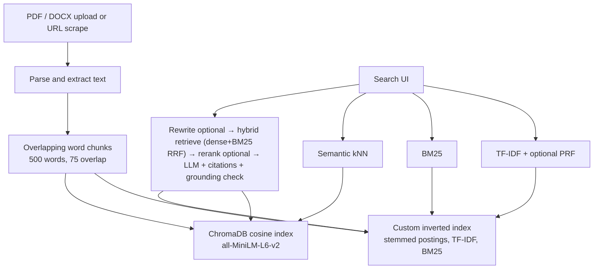

# Dual-Engine Document Search & RAG

**Course:** Modern Information Retrieval — Final Project  
**Author:** Hamed Zare  
**Repository:** https://github.com/Hmd200/mir-search-rag

A full-stack search engine that keeps a **hand-built inverted index** and a **Chroma vector store** in sync, then lets you switch between classical lexical retrieval (TF-IDF / BM25), dense semantic search, and citation-grounded RAG from one web UI.

---

## 1. Overview

| Surface | What you get |
|---|---|
| **Admin** (`/admin`) | Upload PDF/DOCX, scrape a public URL, list the corpus, delete (both indexes cleaned together) |
| **Search** (`/`) | TF-IDF, BM25 (default / tunable / finetuned), Semantic, or RAG, with PRF, query rewrite, and rerank as toggles |

Lexical scoring is implemented from scratch (postings, TF-IDF cosine, Okapi BM25, champion lists, Rocchio PRF). Semantic search and RAG use `sentence-transformers/all-MiniLM-L6-v2` locally. Generation defaults to **Ollama** (`qwen3:8b`); **Gemini** is an optional RAG toggle when `MIR_GEMINI_API_KEY` is set.

---

## 2. Architecture



**Indexing.** An admin upload (PDF/DOCX) or public URL is parsed to text, split into overlapping word chunks (500 words, 75-word overlap), then written to both stores: a custom inverted index (tokenized, stop-word filtered, Porter-stemmed postings with term frequencies) and Chroma (dense vectors from `all-MiniLM-L6-v2`, plus chunk text and metadata). Add and delete go through one path. If the vector write fails after the keyword write (or the reverse on delete), the other index is rolled back so the two stores stay aligned.

**Querying.** TF-IDF (optional Rocchio PRF) and BM25 score the inverted index. Semantic search embeds the query with the same encoder and retrieves nearest chunks from Chroma. RAG optionally rewrites the query for the **dense** arm only, then always fuses dense top-20 with BM25 top-20 (finetuned `k1`/`b`, original user wording) by unweighted RRF (`k=60`). Optional cross-encoder rerank, generation, and grounding stay on the original question. Each accepted citation group of at most two factual sentences must end with an in-range citation (a citation covers preceding sentences only); verifier failure causes safe abstention. Grounding verification adds one LLM call to successful RAG generation and is best-effort—not a formal entailment guarantee, and it does not make hallucinations impossible.

**Runtime layout** (created on first API start; gitignored except placeholders):

| Path | Role |
|---|---|
| `data/uploads/` | Stored PDF/DOCX files |
| `data/indexes/` | Persisted inverted-index JSON |
| `data/chroma/` | Persistent Chroma collection |
| `data/database/mir.db` | SQLite document/chunk metadata |
| `data/models/` | Local embedding / reranker cache |

---

## 3. Retrieval methods

| Method | Scoring | Notes |
|---|---|---|
| **TF-IDF (VSM)** | Cosine over `(1 + log tf) × idf` on **both** query and document (SMART `ltc.ltc`) | Default search uses **champion lists** (top-50 postings per term by TF), then full postings if there are too few candidates. **Rocchio PRF** (`α=1`, `β=0.75`) is a UI toggle; expansion terms are shown as chips. |
| **BM25** | Okapi BM25, Lucene IDF `ln(1 + (N−df+0.5)/(df+0.5))` | Three modes: **default** always uses `k1=1.5`, `b=0.75`; **tunable** uses request `k1`/`b`; **finetuned** uses `MIR_BM25_FINETUNED_K1` / `MIR_BM25_FINETUNED_B` (also `1.5` / `0.75` after an in-sample sweep that tied). The UI always sends the selected mode. The response reports the mode and the effective `k1`/`b`. |
| **Semantic** | Cosine nearest neighbors in Chroma | Same encoder for documents and queries. |
| **RAG** | Optional rewrite → **hybrid retrieve** (dense top-20 + BM25 top-20, unweighted RRF `k=60`) → optional rerank → generate → same-model grounding verify | Dense rewrite is optional; BM25 and the lexical gate always use the original question. Prompt requires `[1]…[N]` citations. Fabricated markers are stripped. A successful cited draft is rewritten once against the retrieved context; each accepted group of at most two factual sentences must end with an in-range citation (configurable via `MIR_RAG_MAX_SENTENCES_PER_CITATION_GROUP`). The relevance gate admits a chunk if dense cosine ≥ `MIR_RAG_MIN_RETRIEVAL_SCORE` **or** BM25-backed lexical coverage/IDF-coverage (`MIR_RAG_LEXICAL_COVERAGE_MIN` / `MIR_RAG_LEXICAL_IDF_COVERAGE_MIN`) **or** the existing all-terms-present bypass. Verifier failure (or empty/`INSUFFICIENT_EVIDENCE` output) abstains. Model may also abstain with `INSUFFICIENT_EVIDENCE` earlier. Grounding verification adds one LLM call to successful generation and is best-effort, not a formal entailment check. |

Lexical preprocessing: Unicode tokenization, stop-word removal, **Porter stemming**. Ranking is **per chunk**; the UI shows document title, score, and a snippet (with page range when known).

---

## 4. Features (mapped to the spec)

### Required

- PDF (PyMuPDF) and DOCX (python-docx) parsing, overlapping chunks, dual indexing
- Custom inverted index + Chroma; synchronized add/delete with rollback
- TF-IDF, BM25, inexact top-k (champion lists), Rocchio PRF
- RAG with citations; Ollama by default, optional Gemini
- Admin upload / table / delete; Search bar, method selector, PRF toggle, ranked snippets or RAG answer + sources

### Bonus (all three)

- **Web scraping (+5).** Admin URL field → `trafilatura` main-text extract → same dual-index path. SSRF guard (DNS + private/loopback IPs, including redirects), 10s timeout, 5 MB cap.
- **Visualization (+5).** Graded term-contribution highlighting; TF-IDF/BM25 **keyword heatmap**; lexical/semantic **document-relation graph** (shared `matched_terms`, or score proximity when terms are absent). Click a node or heatmap row to jump to that result card.
- **Advanced RAG (+5).** Optional **query rewrite** before dense retrieval (`rewritten_query` shown in the UI) and optional **cross-encoder rerank** (`cross-encoder/ms-marco-MiniLM-L-6-v2`). BM25 and the lexical gate always use the original question. Cited chunks show dense cosine, BM25, RRF fusion, and rerank scores (missing arms render as n/a, never 0.0).

---

## 5. Setup

### Prerequisites

- Python **3.12**
- Node.js **24** (or current LTS)
- [Ollama](https://ollama.com) for local RAG (optional if you only use Gemini)
- Git

Create the virtualenv at the **repository root** (the API reads `.env` and `data/` from the root).

### Backend

```bash
# from the repository root
python -m venv .venv

# Windows PowerShell
.\.venv\Scripts\Activate.ps1
# macOS / Linux
# source .venv/bin/activate

cd backend
pip install -e ".[dev]"
```

`pip install -e ".[dev]"` is the install command: it installs the API **and** pytest. There is no `requirements.txt`; dependencies live in `backend/pyproject.toml`.

If PowerShell blocks `Activate.ps1`:

```powershell
Set-ExecutionPolicy -Scope CurrentUser -ExecutionPolicy RemoteSigned
```

Optional config (defaults are enough for local use):

```bash
# from the repository root
cp .env.example .env
```

On Windows: `copy .env.example .env`

Run tests (venv must be active, or use the venv Python explicitly):

```bash
cd backend
python -m pytest -q
```

Windows, without activating, from `backend/`:

```powershell
..\.venv\Scripts\python.exe -m pytest -q
```

Start the API from `backend/`:

```bash
uvicorn app.main:app --reload
```

API: http://127.0.0.1:8000 — OpenAPI docs: http://127.0.0.1:8000/docs  

Wait until `Application startup complete.` The first start in a session can take ~30s while the embedding model loads.

### Frontend

Second terminal, venv not required:

```bash
cd frontend
npm install
npm run dev
```

UI: http://localhost:5173  

Vite proxies `/api` to `http://127.0.0.1:8000`.

| Page | URL |
|---|---|
| Search | http://localhost:5173/ |
| Admin | http://localhost:5173/admin |

### LLM setup (Ollama and optional Gemini)

RAG can use **local Ollama** or **Google Gemini**. Lexical and semantic search need neither.

**Ollama (default, no API key)**

1. Install [Ollama](https://ollama.com).
2. Pull the default generation model and confirm it is listed:

```bash
ollama pull qwen3:8b
ollama list
```

3. Leave the default endpoint `http://127.0.0.1:11434`. Override `MIR_OLLAMA_BASE_URL` or `MIR_OLLAMA_MODEL` in a root `.env` only if you copied `.env.example` and changed those values.
4. Recommended: `OLLAMA_KEEP_ALIVE=30m` so the model is not unloaded between requests.
5. In the Search UI, select RAG → **Ollama (local)**.

**Gemini (optional API key)**

1. Create a key in [Google AI Studio](https://aistudio.google.com/apikey).
2. Copy `.env.example` to `.env` at the repository root and set:

```bash
MIR_GEMINI_API_KEY=your_key_here
```

3. Restart the API. In the Search UI, select RAG → **Gemini (API)**.
4. Optional: `MIR_GEMINI_MODEL` (default `gemini-2.5-flash`).

Do not commit `.env`. Embedding and reranker weights (`sentence-transformers/all-MiniLM-L6-v2`, `cross-encoder/ms-marco-MiniLM-L-6-v2`) download from Hugging Face on first API start. Those models are public; no Hugging Face token is required.

### Configuration (`MIR_` prefix)

All optional. `.env` is loaded from the **repository root**.

| Variable | Default | Purpose |
|---|---|---|
| `MIR_CORS_ORIGINS` | localhost / 127.0.0.1 ports 5173 and 4173 | Frontend origins |
| `MIR_EMBEDDING_MODEL` | `sentence-transformers/all-MiniLM-L6-v2` | Document and query embeddings |
| `MIR_EMBEDDING_DEVICE` | `cpu` | `cpu` or `cuda` |
| `MIR_OLLAMA_BASE_URL` | `http://127.0.0.1:11434` | Ollama server |
| `MIR_OLLAMA_MODEL` | `qwen3:8b` | RAG generation model (Ollama) |
| `MIR_LLM_PROVIDER` | `ollama` | Default generator if the UI omits a choice |
| `MIR_GEMINI_API_KEY` | empty | Required only for the Gemini RAG option |
| `MIR_GEMINI_MODEL` | `gemini-2.5-flash` | Gemini model id |
| `MIR_MAX_UPLOAD_SIZE_MB` | `25` | Upload cap |
| `MIR_CHUNK_SIZE` | `500` | Words per chunk |
| `MIR_CHUNK_OVERLAP` | `75` | Overlap in words |
| `MIR_RAG_MIN_RETRIEVAL_SCORE` | `0.30` | Minimum **dense cosine** for the hybrid RAG relevance gate. A context set also passes if a BM25-backed chunk meets the lexical coverage floors, or if the all-terms-present bypass fires. Do not treat this as an RRF/fusion threshold. |
| `MIR_RAG_MAX_SENTENCES_PER_CITATION_GROUP` | `2` | Maximum factual sentences a single terminal citation group may cover. A citation supports only the preceding sentences in its group, never following ones. `1` restores strict per-sentence citations. |
| `MIR_RAG_LEXICAL_COVERAGE_MIN` | `0.60` | Hybrid RAG lexical gate: minimum unique-term overlap `\|Q ∩ C\| / \|Q\|` for a BM25-retrieved chunk. |
| `MIR_RAG_LEXICAL_IDF_COVERAGE_MIN` | `0.40` | Hybrid RAG lexical gate: minimum IDF-weighted overlap of query terms present in the chunk. Out-of-vocabulary query terms stay in the denominator. |
| `MIR_BM25_FINETUNED_K1` | `1.5` | `k1` for `bm25_mode=finetuned` and for the RAG hybrid BM25 arm. Request `k1` is ignored in finetuned mode. Selected by an in-sample nDCG@4 sweep on the 12-query eval gold set; the grid tied, so the standard empirical baseline was retained. |
| `MIR_BM25_FINETUNED_B` | `0.75` | `b` for `bm25_mode=finetuned` and for the RAG hybrid BM25 arm. Request `b` is ignored in finetuned mode. Same in-sample calibration as `MIR_BM25_FINETUNED_K1`. |

BM25 **default** mode is the standard empirical pair `k1=1.5`, `b=0.75` and ignores request `k1`/`b`. **Tunable** mode uses the request fields (query-param defaults remain `1.5`/`0.75`). Omitting `bm25_mode` preserves the previous API: request `k1`/`b` are used. PRF `α`/`β` and rerank remain request/UI parameters (or fields in `backend/app/core/config.py`).

---

## 6. Using the system

1. Open Admin, drop a PDF or DOCX (or paste a public URL).
2. Wait until both **Keyword** and **Vector** badges say indexed.
3. Search the same query as TF-IDF, BM25, and RAG to compare.
4. On TF-IDF, toggle **Pseudo-Relevance Feedback** — expansion terms appear above the list; rankings can change.
5. On RAG, optionally enable **Rewrite query** and **Rerank results**. Citations in the answer jump to source cards.
6. Delete a document in Admin; it should disappear from lexical and semantic/RAG results.

---

## 7. Testing

```bash
cd backend
python -m pytest -q
```

Coverage includes chunking and offsets, TF-IDF/BM25 scoring, champion lists vs exact search, Rocchio expansion, dual-index sync and rollback, RAG citations (including fake markers and `<think>` stripping), query rewrite, reranker behavior, and URL scraping / SSRF rejection.

Frontend production build:

```bash
cd frontend
npm run build
```

---

## 8. Evaluation

Offline eval in `backend/evaluation/`: four short corpus files, a 12-query gold set, a throwaway index (does **not** touch live SQLite/Chroma).

```bash
cd backend
python evaluation/run_evaluation.py
python evaluation/run_evaluation.py --sweep-bm25
```

Writes `backend/evaluation/results.md`. The sweep appends a BM25 `k1`/`b` section without rewriting the method comparison. It builds **one** throwaway inverted index from `backend/evaluation/corpus/`, skips embeddings/Chroma, and scores the 12-query gold set with exact BM25 (`use_champions=False`).

The sweep is **in-sample calibration** on those 12 queries, not an independent test. Primary metric: macro nDCG@4; tie-breaker: MRR; P@4 is reported only (it is structurally flat at `top_k=4` with four documents). 11 of 16 cells tied on nDCG@4 and MRR, so **`k1=1.5`, `b=0.75` was retained** as `MIR_BM25_FINETUNED_K1` / `MIR_BM25_FINETUNED_B`. That pair is not a claim of generalization beyond this gold set.

**P@4 is `|relevant| / 4` on this corpus** (`top_k=4`, four documents). Macro P@4 / MRR / nDCG therefore barely move between methods. Empty-relevant queries are reported separately (true-negative check: P@4 = 0 for every method).

| Split | Queries | P@4 | MRR | nDCG@4 |
|---|---:|---|---|---|
| Exact vocabulary match | 5 | 0.300 all methods | 1.000 all | 1.000 all |
| Vocabulary mismatch | 6 | 0.333 all methods | 1.000 all | 1.000 lexical; **0.987 Semantic** |
| No relevant document | 1 | 0.000 all | 0.000 all | 0.000 all |

Methods still **disagree on rank-1** on some queries (full rankings in `results.md`):

- *“comparing sparse term weighting with dense neural encodings of meaning”* — TF-IDF/BM25 put `semantic_search.txt` first; Semantic puts `classical_ir.txt` first.
- *“…strongest postings per term, or … pairwise model … before the language model…”* — TF-IDF/BM25 put `rag_llm.txt` first; **TF-IDF+PRF** flips to `classical_ir.txt`.

That is the scale at which PRF and semantic search are visible here. A larger, more confusable corpus would be needed for aggregate P@k to separate the methods.

---

## 9. Known limitations

- **Index maintenance is not incremental.** Each add/delete recomputes cosine norms and champion lists for the whole inverted index. Fine for a course-sized corpus.
- **Older uploads** indexed before page-spanning chunks keep the old one-page-per-chunk split until re-uploaded.
- **LLM:** Ollama is default; Gemini needs `MIR_GEMINI_API_KEY`. Retrieval is unchanged.
- **RAG grounding:** Successful answers go through a same-model grounding rewrite; each accepted citation group of at most two factual sentences must end with an in-range citation, and verifier failure abstains. Same-model verification is best-effort and is not a formal entailment guarantee—hallucinations remain possible. Grounding verification adds one LLM call to successful RAG generation.
- **RAG answer-relevance.** Grounding checks claim support, not whether the answer addresses the asked property. A supported but off-target answer (for example a related count instead of the specific one requested) can still be returned. A single-call structured verdict was attempted and did not close this gap without adding a second LLM call.
- **RAG lexical false positives.** Hybrid retrieval admits some dense-weak, BM25-strong questions that have no answer in the corpus. Safe downstream abstention (`model_abstained`, `citation_failure`, or `grounding_failure`) is acceptable; an unsupported answer is not. Calibration of the coverage / IDF-coverage floors was on a small corpus, so phrasing changes can straddle the gate.
- **Demo video** is the remaining submission item (section 10).

---

## 10. Video demonstration

*Link to be added last (5–7 minutes).*

Required shots:

1. Upload a document, then search it.
2. Delete it, then show it gone from lexical **and** semantic/RAG.
3. Same query on TF-IDF (PRF off/on), BM25, and RAG — compare lists vs cited answer.
4. Bonus: URL ingest; heatmap + relation graph; RAG rewrite and rerank.
