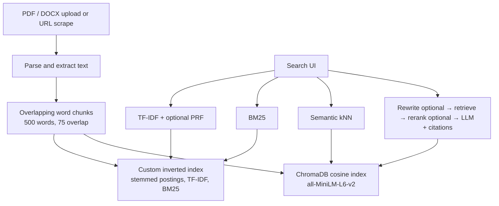

# Dual-Engine Document Search & RAG

**Course:** Modern Information Retrieval — Final Project  
**Author:** Hamed Zare  
**Repository:** https://github.com/Hmd200/mir-search-rag

A full-stack search engine that keeps a **hand-built inverted index** and a **Chroma vector store** in sync, then lets you switch between classical lexical retrieval (TF-IDF / BM25), dense semantic search, and citation-grounded RAG from one web UI.

---

## 1. Overview

| Surface | What you get |
|---|---|
| **Admin** (`/admin`) | Upload PDF/DOCX, scrape a public URL, list the corpus, delete (both indexes cleaned together) |
| **Search** (`/`) | TF-IDF, BM25, Semantic, or RAG, with PRF, query rewrite, and rerank as toggles |

Lexical scoring is implemented from scratch (postings, TF-IDF cosine, Okapi BM25, champion lists, Rocchio PRF). Semantic search and RAG use `sentence-transformers/all-MiniLM-L6-v2` locally. Generation uses **Ollama** (`qwen3:8b` by default) — no cloud API key.

---

## 2. Architecture



Add and delete go through one path. If the vector write fails after the keyword write (or the reverse on delete), the other index is rolled back so the two stores stay aligned.

**Runtime layout** (created on first API start; gitignored except placeholders):

| Path | Role |
|---|---|
| `data/uploads/` | Stored PDF/DOCX files |
| `data/indexes/` | Persisted inverted-index JSON |
| `data/chroma/` | Persistent Chroma collection |
| `data/database/mir.db` | SQLite document/chunk metadata |
| `data/models/` | Local embedding / reranker cache |

---

## 3. Retrieval methods

| Method | Scoring | Notes |
|---|---|---|
| **TF-IDF (VSM)** | Cosine over `(1 + log tf) × idf` on **both** query and document (SMART `ltc.ltc`) | Default search uses **champion lists** (top-50 postings per term by TF), then full postings if there are too few candidates. **Rocchio PRF** (`α=1`, `β=0.75`) is a UI toggle; expansion terms are shown as chips. |
| **BM25** | Okapi BM25, Lucene IDF `ln(1 + (N−df+0.5)/(df+0.5))` | Defaults `k1=1.5`, `b=0.75`, both tunable under Advanced settings. |
| **Semantic** | Cosine nearest neighbors in Chroma | Same encoder for documents and queries. |
| **RAG** | Optional rewrite → semantic retrieve (20) → optional rerank → generate | Prompt requires `[1]…[N]` citations. Fabricated markers are stripped. Model may abstain with `INSUFFICIENT_EVIDENCE`. Rewrite changes **retrieval** only; generation still uses the original question. |

Lexical preprocessing: Unicode tokenization, stop-word removal, **Porter stemming**. Ranking is **per chunk**; the UI shows document title, score, and a snippet (with page range when known).

---

## 4. Features (mapped to the spec)

### Required

- PDF (PyMuPDF) and DOCX (python-docx) parsing, overlapping chunks, dual indexing
- Custom inverted index + Chroma; synchronized add/delete with rollback
- TF-IDF, BM25, inexact top-k (champion lists), Rocchio PRF
- RAG with citations; Ollama generation
- Admin upload / table / delete; Search bar, method selector, PRF toggle, ranked snippets or RAG answer + sources

### Bonus (all three)

- **Web scraping (+5).** Admin URL field → `trafilatura` main-text extract → same dual-index path. SSRF guard (DNS + private/loopback IPs, including redirects), 10s timeout, 5 MB cap.
- **Visualization (+5).** Graded term-contribution highlighting; TF-IDF/BM25 **keyword heatmap**; lexical/semantic **document-relation graph** (shared `matched_terms`, or score proximity when terms are absent). Click a node or heatmap row to jump to that result card.
- **Advanced RAG (+5).** Optional **query rewrite** before retrieval (`rewritten_query` shown in the UI) and optional **cross-encoder rerank** (`cross-encoder/ms-marco-MiniLM-L-6-v2`). Cited chunks show retrieval score and rerank score.

---

## 5. Setup

### Prerequisites

- Python **3.12**
- Node.js **24** (or current LTS)
- [Ollama](https://ollama.com) for RAG
- Git

Create the virtualenv at the **repository root** (the API reads `.env` and `data/` from the root).

### Backend

```bash
# from the repository root
python -m venv .venv

# Windows PowerShell
.\.venv\Scripts\Activate.ps1
# macOS / Linux
# source .venv/bin/activate

cd backend
pip install -e ".[dev]"
```

`pip install -e ".[dev]"` installs the API **and** pytest. Dependencies live in `backend/pyproject.toml` (there is no `requirements.txt`).

If PowerShell blocks `Activate.ps1`:

```powershell
Set-ExecutionPolicy -Scope CurrentUser -ExecutionPolicy RemoteSigned
```

Optional config (defaults are enough for local use):

```bash
# from the repository root
cp .env.example .env
```

On Windows: `copy .env.example .env`

Run tests (venv must be active, or use the venv Python explicitly):

```bash
cd backend
python -m pytest -q
```

Windows, without activating, from `backend/`:

```powershell
..\.venv\Scripts\python.exe -m pytest -q
```

Start the API from `backend/`:

```bash
uvicorn app.main:app --reload
```

API: http://127.0.0.1:8000 — OpenAPI docs: http://127.0.0.1:8000/docs  

Wait until `Application startup complete.` The first start in a session can take ~30s while the embedding model loads.

### Frontend

Second terminal, venv not required:

```bash
cd frontend
npm install
npm run dev
```

UI: http://localhost:5173  

Vite proxies `/api` to `http://127.0.0.1:8000`.

| Page | URL |
|---|---|
| Search | http://localhost:5173/ |
| Admin | http://localhost:5173/admin |

### Ollama (RAG only)

Lexical and semantic search work without Ollama. RAG needs a local model:

```bash
ollama pull qwen3:8b
ollama list
```

Default endpoint: `http://127.0.0.1:11434`. Recommended: `OLLAMA_KEEP_ALIVE=30m` so the model is not unloaded between requests.

### Configuration (`MIR_` prefix)

All optional. `.env` is loaded from the **repository root**.

| Variable | Default | Purpose |
|---|---|---|
| `MIR_CORS_ORIGINS` | localhost / 127.0.0.1 ports 5173 and 4173 | Frontend origins |
| `MIR_EMBEDDING_MODEL` | `sentence-transformers/all-MiniLM-L6-v2` | Document and query embeddings |
| `MIR_EMBEDDING_DEVICE` | `cpu` | `cpu` or `cuda` |
| `MIR_OLLAMA_BASE_URL` | `http://127.0.0.1:11434` | Ollama server |
| `MIR_OLLAMA_MODEL` | `qwen3:8b` | RAG generation model |
| `MIR_MAX_UPLOAD_SIZE_MB` | `25` | Upload cap |
| `MIR_CHUNK_SIZE` | `500` | Words per chunk |
| `MIR_CHUNK_OVERLAP` | `75` | Overlap in words |

BM25 `k1`/`b`, PRF `α`/`β`, and rerank are request/UI parameters (or fields in `backend/app/core/config.py`), not all listed in `.env.example`.

---

## 6. Using the system

1. Open Admin, drop a PDF or DOCX (or paste a public URL).
2. Wait until both **Keyword** and **Vector** badges say indexed.
3. Search the same query as TF-IDF, BM25, and RAG to compare.
4. On TF-IDF, toggle **Pseudo-Relevance Feedback** — expansion terms appear above the list; rankings can change.
5. On RAG, optionally enable **Rewrite query** and **Rerank results**. Citations in the answer jump to source cards.
6. Delete a document in Admin; it should disappear from lexical and semantic/RAG results.

---

## 7. Testing

```bash
cd backend
python -m pytest -q
```

Coverage includes chunking and offsets, TF-IDF/BM25 scoring, champion lists vs exact search, Rocchio expansion, dual-index sync and rollback, RAG citations (including fake markers and `<think>` stripping), query rewrite, reranker behavior, and URL scraping / SSRF rejection.

Frontend production build:

```bash
cd frontend
npm run build
```

---

## 8. Evaluation

Offline eval in `backend/evaluation/`: four short corpus files, a 12-query gold set, a throwaway index (does **not** touch live SQLite/Chroma).

```bash
cd backend
python evaluation/run_evaluation.py
```

Writes `backend/evaluation/results.md`.

**P@4 is `|relevant| / 4` on this corpus** (`top_k=4`, four documents). Macro P@4 / MRR / nDCG therefore barely move between methods. Empty-relevant queries are reported separately (true-negative check: P@4 = 0 for every method).

| Split | Queries | P@4 | MRR | nDCG@4 |
|---|---:|---|---|---|
| Exact vocabulary match | 5 | 0.300 all methods | 1.000 all | 1.000 all |
| Vocabulary mismatch | 6 | 0.333 all methods | 1.000 all | 1.000 lexical; **0.987 Semantic** |
| No relevant document | 1 | 0.000 all | 0.000 all | 0.000 all |

Methods still **disagree on rank-1** on some queries (full rankings in `results.md`):

- *“comparing sparse term weighting with dense neural encodings of meaning”* — TF-IDF/BM25 put `semantic_search.txt` first; Semantic puts `classical_ir.txt` first.
- *“…strongest postings per term, or … pairwise model … before the language model…”* — TF-IDF/BM25 put `rag_llm.txt` first; **TF-IDF+PRF** flips to `classical_ir.txt`.

That is the scale at which PRF and semantic search are visible here. A larger, more confusable corpus would be needed for aggregate P@k to separate the methods.

---

## 9. Known limitations

- **Index maintenance is not incremental.** Each add/delete recomputes cosine norms and champion lists for the whole inverted index. Fine for a course-sized corpus.
- **Older uploads** indexed before page-spanning chunks keep the old one-page-per-chunk split until re-uploaded.
- **LLM provider** is Ollama only (`MIR_LLM_PROVIDER` is reserved for a later client).
- **Demo video** is the remaining submission item (section 10).

---

## 10. Video demonstration

*Link to be added last (5–7 minutes).*

Required shots:

1. Upload a document, then search it.
2. Delete it, then show it gone from lexical **and** semantic/RAG.
3. Same query on TF-IDF (PRF off/on), BM25, and RAG — compare lists vs cited answer.
4. Bonus: URL ingest; heatmap + relation graph; RAG rewrite and rerank.
